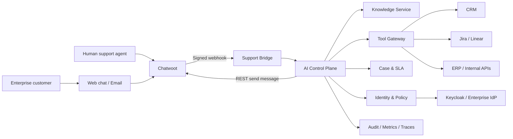

# Architecture

## Architectural style

The first production shape is a **modular monolith plus asynchronous workers**, integrated with Chatwoot as an external bounded context. This minimizes distributed-systems overhead while preserving module boundaries that can later be extracted.

## Context diagram



## Deployment units for MVP

```text
chatwoot-web
chatwoot-sidekiq
ai-platform-api
ai-platform-worker
admin-web
postgres-chatwoot
postgres-ai
redis-chatwoot
redis-ai
minio
keycloak
observability stack
```

The custom API contains modules, not network microservices. Extraction candidates are Knowledge Worker, Integration Hub and Evaluation Runner after measured need.

## Bounded contexts

### Chatwoot support kernel

Owns inboxes, channels, contacts, conversations, messages, human agents, teams, assignments, labels, basic automation and CSAT.

### Identity and policy

Owns tenant, enterprise account, department, membership, role, policy, external identity and authorization decisions. It resolves tenant context server-side.

### Case and SLA

Owns enterprise support cases, priority, assignment, escalation, SLA clocks, pause conditions, resolution and reopening. A Case may link multiple Chatwoot conversations.

### Knowledge

Owns source connectors, documents, immutable versions, parsing artifacts, chunks, embeddings, ACLs, publication, expiry and conflict metadata.

### Agent runtime

Owns routing, context construction, retrieval requests, prompt/model versions, generation, validation, abstention and customer response proposals.

### Tool Gateway

Owns tool definitions, credentials references, authorization, action preview, confirmation, idempotency, execution, postcondition verification and audit.

### Integration Hub

Owns connector configurations, external resource mappings, webhook subscriptions, sync cursors, retries and dead-letter recovery.

### Evaluation and observability

Owns evaluation datasets, release gates, production traces, quality metrics, cost, latency and knowledge-gap classification.

## Critical data flow: inbound customer message

1. Chatwoot receives and persists the message.
2. Chatwoot sends a signed webhook.
3. Support Bridge verifies signature, timestamp and replay window.
4. The raw payload is encrypted or minimized and stored with an InboxEvent row.
5. The transaction commits before the job is enqueued.
6. Worker resolves tenant and external mappings.
7. Runtime acquires an AI control lease for the conversation.
8. Runtime routes the request and performs retrieval or a deterministic flow.
9. Before sending, the runtime verifies that the lease version is unchanged.
10. The response is sent through the Chatwoot API with an idempotency key.
11. Run, citations, audit events and metrics are persisted.

## Data storage

### PostgreSQL AI database

- Authoritative store for custom domain entities.
- RLS on tenant-owned tables.
- pgvector for the initial vector index.
- PostgreSQL FTS for initial lexical retrieval.
- Transactional Inbox and Outbox tables.

### Object storage

- Immutable original documents.
- Parsed artifacts and large evaluation fixtures.
- Tenant-prefixed object keys.
- Server-side encryption and retention policies.

### Redis AI

- Celery broker/result coordination where necessary.
- Bounded caches and distributed control leases.
- No authoritative business state.
- Separate instance or cluster from Chatwoot.

## Search architecture

MVP retrieval:

```text
ACL/tenant pre-filter
  → PostgreSQL FTS candidates
  + pgvector candidates
  → rank fusion
  → reranker with deadline
  → citation construction
```

Upgrade triggers:

- Add OpenSearch when lexical search, aggregations or corpus scale exceed PostgreSQL benchmarks.
- Add Milvus only when vector volume/concurrency is demonstrated to be the bottleneck.
- Do not operate PostgreSQL, OpenSearch and Milvus simultaneously without clear ownership and reconciliation rules.

## Consistency model

- Chatwoot and the custom platform are eventually consistent.
- External mappings carry source version and last synchronization time.
- Business commands are idempotent.
- Inbound events are at-least-once; consumers deduplicate by event ID.
- The source system remains authoritative for its owned resources.
- Cross-system workflows use explicit states and compensating actions, not distributed transactions.

## Availability and degradation

| Dependency failure | Required behavior |
|---|---|
| LLM unavailable | Queue or hand off; never fabricate |
| Retrieval unavailable | Do not answer enterprise facts; offer human handoff |
| CRM unavailable | State that live data cannot be verified; do not use stale values silently |
| Reranker unavailable | Fall back to fused retrieval only if evaluation allows |
| Chatwoot API unavailable | Retain outbound command and retry idempotently |
| Redis unavailable | Reject new AI ownership safely; human support remains available |
| Worker backlog | Display delayed state and scale workers; protect interactive priority queue |

## Performance targets

- Webhook acknowledgement P95: < 300 ms
- Human handoff control event P95: < 1 s
- First token P95 for knowledge answers: < 2.5 s
- Completed normal answer P95: < 8 s
- Read-tool P95 excluding third-party latency: < 3 s
- No duplicate customer-visible replies under at-least-once delivery
- Tenant authorization decision P95: < 50 ms cached, < 150 ms uncached

## Evolution strategy

Extract a module only when one or more are true:

- independent scaling is required;
- failure isolation materially improves reliability;
- a separate team owns it;
- release cadence conflicts are measurable;
- compliance requires independent deployment.

Every extraction requires an ADR, contract tests, migration plan, observability and rollback.
